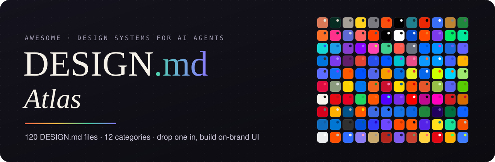

<p align="center">
  <a href="https://ayushap18.github.io/design-md-atlas/"></a>
</p>

<p align="center">
  <a href="https://ayushap18.github.io/design-md-atlas/"></a>
  
  <a href="REPOS.md"></a>
  <a href="https://github.com/google-labs-code/design.md"></a>
  <a href="LICENSE"></a>
</p>

<p align="center">
  <b>Drop a <code>DESIGN.md</code> into your project. Your coding agent builds on-brand UI.</b><br>
  <sub>Works with Claude Code · Cursor · Codex · Gemini CLI · Google Stitch · Copilot · any agent that reads markdown</sub>
</p>

<p align="center">
  <a href="#-quick-start">Quick start</a> ·
  <a href="#-whats-inside-a-designmd">Anatomy</a> ·
  <a href="#-the-catalog">Catalog</a> ·
  <a href="REPOS.md">67 repos</a> ·
  <a href="#-contributing">Contribute</a>
</p>

---

## ⚡ Quick start

```bash
# 1. grab a design system into your project root
curl -o DESIGN.md https://raw.githubusercontent.com/ayushap18/design-md-atlas/main/design-md/developer-tools/linear/DESIGN.md

# 2. ask your agent
claude "Read DESIGN.md and build a pricing page that follows it exactly."
```

> [!TIP]
> Browse, preview every palette and copy files in one click on the **[Atlas website](https://ayushap18.github.io/design-md-atlas/)**.

## 🧬 What's inside a DESIGN.md

Every file follows the [DESIGN.md spec](https://github.com/google-labs-code/design.md) introduced by Google Stitch: **machine-readable tokens** up top, **human-readable rationale** below.

<table>
<tr>
<td width="50%" valign="top">

**🎛️ YAML frontmatter**

```yaml
---
name: Linear
colors:
  primary: "#5E6AD2"
  background: "#08090A"
  text: "#F7F8F8"
typography:
  display: { fontFamily: Inter Display, fontSize: 4rem }
rounded: { md: 6px, lg: 12px }
components:
  button-primary:
    backgroundColor: "{colors.primary}"
---
```

</td>
<td width="50%" valign="top">

**📖 Markdown body, in spec order**

| | Section |
|:-:|:--|
| 🌅 | Overview — mood & personality |
| 🎨 | Colors — every token + its role |
| 🔤 | Typography — families, scale, tracking |
| 📐 | Layout — grid, widths, rhythm |
| 🪟 | Elevation & Depth |
| 🔷 | Shapes — radii, icons, imagery |
| 🧩 | Components — buttons, cards, nav… |
| ✅ | Do's and Don'ts |
| 🤖 | Agent Prompt Guide — paste-ready prompts |

</td>
</tr>
</table>

## 🧭 The catalog

<!-- catalog:start -->
<p>
<a href="#ai--llm"></a>
<a href="#developer-tools"></a>
<a href="#backend--infra"></a>
<a href="#productivity"></a>
<a href="#design-tools"></a>
<a href="#fintech"></a>
<a href="#e-commerce--consumer"></a>
<a href="#media--entertainment"></a>
<a href="#mobility--hardware"></a>
<a href="#public-design-systems"></a>
<a href="#saas--marketing"></a>
<a href="#aesthetics"></a>
</p>

### AI & LLM

| Palette | Name | Vibe |
|:--|:--|:--|
|  | **[Anthropic / Claude](design-md/ai-llm/anthropic-claude/DESIGN.md)** | Warm, bookish minimalism — ivory paper, near-black ink, and a single terracotta "clay" accent, set in a humanist sans and an editorial serif. |
|  | **[Cohere](design-md/ai-llm/cohere/DESIGN.md)** | Enterprise-calm AI — warm stone neutrals, deep forest greens and a coral spark, with an editorial serif display paired to a clean grotesk. |
|  | **[ElevenLabs](design-md/ai-llm/elevenlabs/DESIGN.md)** | Audio-first luxury minimalism — warm off-white canvas, black pill buttons, a refined display face, and soft pastel orb gradients that represent voice. |
|  | **[Hugging Face](design-md/ai-llm/hugging-face/DESIGN.md)** | Friendly open-source hub — clean white and slate-gray product UI, a sunny yellow emoji mascot, and dense, card-based listings with colorful task tags. |
|  | **[Midjourney](design-md/ai-llm/midjourney/DESIGN.md)** | Gallery-dark creative tool — near-black canvas that steps aside for an endless masonry wall of generated images, with tiny type and a single warm-coral highlight. |
|  | **[Mistral AI](design-md/ai-llm/mistral-ai/DESIGN.md)** | Retro-pixel warmth — a sunset gradient of red, orange and yellow blocks on cream or black, with chunky pixel motifs and square-cornered UI. |
|  | **[OpenAI](design-md/ai-llm/openai/DESIGN.md)** | Stark monochrome editorial — white canvas, black type, pill-shaped controls and large-format imagery, with color reserved for art and product media. |
|  | **[Perplexity](design-md/ai-llm/perplexity/DESIGN.md)** | Scholarly-tech answer engine — paper-white or deep teal-black canvases, a signature "true turquoise" accent, and clean grotesk type with numbered citations. |
|  | **[Replicate](design-md/ai-llm/replicate/DESIGN.md)** | Hacker-friendly ML platform — stark black-and-white with a hot red-orange accent, a geometric grotesk, and code blocks as hero elements. |
|  | **[Runway](design-md/ai-llm/runway/DESIGN.md)** | Cinematic AI studio — black-dominant, film-forward pages with huge clean grotesk headlines, full-bleed video and crisp white UI accents. |

### Developer Tools

| Palette | Name | Vibe |
|:--|:--|:--|
|  | **[Cursor](design-md/developer-tools/cursor/DESIGN.md)** | Warm, crafted editor brand — parchment off-whites and espresso near-black, a custom grotesk with an editorial serif, and IDE screenshots framed like objects. |
|  | **[GitHub](design-md/developer-tools/github/DESIGN.md)** | Utility-first Primer system — neutral grays, a functional blue for links and a green for primary actions, Mona Sans headlines, and dense bordered boxes; marketing pages go dark and cosmic. |
|  | **[GitLab](design-md/developer-tools/gitlab/DESIGN.md)** | Confident DevSecOps brand — deep charcoal-purple, the orange-to-red tanuki gradient, a purple secondary, and GitLab Sans across dense Pajamas-system UI. |
|  | **[JetBrains](design-md/developer-tools/jetbrains/DESIGN.md)** | Black canvas with electric multi-product gradients — each IDE owns a neon color pair, set against bold JetBrains Sans headlines and clean dark UI. |
|  | **[Linear](design-md/developer-tools/linear/DESIGN.md)** | Dark, quiet, and exacting — a near-black canvas, Inter Display headlines in soft gradients of white, a desaturated indigo accent and fine 1px borders on everything. |
|  | **[Raycast](design-md/developer-tools/raycast/DESIGN.md)** | Glossy macOS-native darkness — deep black canvas, glassy command-bar windows, a coral-red brand mark, and vivid diagonal light streaks in red, blue and purple. |
|  | **[Replit](design-md/developer-tools/replit/DESIGN.md)** | Builder-friendly warmth — cream and charcoal neutrals, a vivid orange brand mark, Replit Diatype type, and rounded, approachable app UI. |
|  | **[Vercel](design-md/developer-tools/vercel/DESIGN.md)** | Precision monochrome — pure black and white, Geist typography, hairline borders and grid lines, with the triangle mark and occasional prismatic gradients. |
|  | **[Warp](design-md/developer-tools/warp/DESIGN.md)** | Modern terminal brand — inky black canvas, soft lavender accent, the Matter grotesk, and terminal "blocks" rendered as clean rounded panels. |
|  | **[Zed](design-md/developer-tools/zed/DESIGN.md)** | Engineer's editorial — paper-white and slate surfaces, a crisp cobalt blue accent, a serif-meets-sans type pairing, and editor screenshots with tight, fine detail. |

### Backend & Infra

| Palette | Name | Vibe |
|:--|:--|:--|
|  | **[Cloudflare](design-md/backend-infra/cloudflare/DESIGN.md)** | Enterprise-scale network branding with clean white pages, deep navy text, and Cloudflare's signature orange used for calls to action and the cloud mark. |
|  | **[Fly.io](design-md/backend-infra/fly-io/DESIGN.md)** | Whimsical, illustrated app-hosting brand mixing an editorial serif, a lilac-and-violet palette and hand-drawn hot-air-balloon art. |
|  | **[MongoDB](design-md/backend-infra/mongodb/DESIGN.md)** | Confident developer-data brand built on deep slate-teal, a vivid spring green and warm off-white, set in a precise Swiss grotesk. |
|  | **[Neon](design-md/backend-infra/neon/DESIGN.md)** | Serverless Postgres branding with a near-black, green-tinted dark canvas, a luminous neon-green accent, and crisp engineering typography. |
|  | **[Netlify](design-md/backend-infra/netlify/DESIGN.md)** | Bright, friendly web-platform branding built on deep teal, aqua accents and a crisp blue for links and actions. |
|  | **[PlanetScale](design-md/backend-infra/planetscale/DESIGN.md)** | Austere, text-first database branding — system fonts, black-on-white, dense copy and almost no decoration. |
|  | **[Railway](design-md/backend-infra/railway/DESIGN.md)** | Moody deep-violet night-sky aesthetic with soft pink and purple glows, glassy panels and a canvas-style infrastructure UI. |
|  | **[Render](design-md/backend-infra/render/DESIGN.md)** | Clean, modern cloud-platform branding with a black-and-white base and a vivid electric violet accent. |
|  | **[Sentry](design-md/backend-infra/sentry/DESIGN.md)** | Irreverent, dark-purple developer brand with neon pink and lime highlights, chunky Rubik type and comic-style illustrations. |
|  | **[Supabase](design-md/backend-infra/supabase/DESIGN.md)** | Dark-first developer marketing with near-black surfaces, a single emerald green accent, and code-forward product shots. |

### Productivity

| Palette | Name | Vibe |
|:--|:--|:--|
|  | **[Asana](design-md/productivity/asana/DESIGN.md)** | Warm, editorial work-management brand — near-black and bone-white canvases, coral accents, a sharp sans paired with an elegant serif. |
|  | **[Cal.com](design-md/productivity/cal-com/DESIGN.md)** | Monochrome, open-source scheduling infrastructure brand — near-black on white, the custom Cal Sans display, and crisp bordered UI. |
|  | **[Calendly](design-md/productivity/calendly/DESIGN.md)** | Clean, trustworthy scheduling brand — deep navy text, bright Calendly blue, and soft pastel gradients around booking-page mockups. |
|  | **[ClickUp](design-md/productivity/clickup/DESIGN.md)** | High-energy all-in-one productivity brand with a purple-to-pink gradient identity, bold geometric type and dense product showcases. |
|  | **[Loom](design-md/productivity/loom/DESIGN.md)** | Bright, approachable async-video brand with a signature blurple, rounded geometric type and camera-bubble product visuals. |
|  | **[monday.com](design-md/productivity/monday/DESIGN.md)** | Upbeat, colorful work-OS brand with a bright indigo primary, multicolor status pills and rounded Poppins/Figtree type. |
|  | **[Notion](design-md/productivity/notion/DESIGN.md)** | Calm, paper-like workspace aesthetic — warm off-white, soft black ink, Inter type and hand-drawn black-and-white illustrations. |
|  | **[Obsidian](design-md/productivity/obsidian/DESIGN.md)** | Dark, private, craftsman knowledge-base aesthetic — charcoal surfaces, violet crystal accent and quiet, readable type. |
|  | **[Slack](design-md/productivity/slack/DESIGN.md)** | Friendly, colorful workplace brand anchored by aubergine purple, with the four-color logo palette used as playful accents. |
|  | **[Todoist](design-md/productivity/todoist/DESIGN.md)** | Warm, calm task-manager brand with cream backgrounds, tomato-red accents and a friendly slab-serif display. |

### Design Tools

| Palette | Name | Vibe |
|:--|:--|:--|
|  | **[Adobe](design-md/design-tools/adobe/DESIGN.md)** | Corporate-creative polish built on the Spectrum system — clean white layouts, Adobe red brand mark and blue interactive accents. |
|  | **[Behance](design-md/design-tools/behance/DESIGN.md)** | Adobe's creative portfolio network — crisp white galleries, black type and an electric Behance blue for every action. |
|  | **[Canva](design-md/design-tools/canva/DESIGN.md)** | Friendly, optimistic purple-to-teal gradients on white with rounded, approachable UI that makes design feel effortless. |
|  | **[Dribbble](design-md/design-tools/dribbble/DESIGN.md)** | A gallery-first showcase — clean white space, deep ink-navy type and a signature hot pink, with shots doing all the talking. |
|  | **[Figma](design-md/design-tools/figma/DESIGN.md)** | Monochrome black-and-white canvas punctuated by saturated, toy-like blocks of color pulled from the five-dot logo. |
|  | **[Framer](design-md/design-tools/framer/DESIGN.md)** | Pitch-black, cinematic product site with white type, electric-blue highlights and motion-first showcase frames. |
|  | **[Miro](design-md/design-tools/miro/DESIGN.md)** | Sunny yellow brand energy over a calm white workspace, with a strong blue for actions and sticky-note colorful collaboration. |
|  | **[Sketch](design-md/design-tools/sketch/DESIGN.md)** | Calm, crafted Mac-native aesthetic — warm off-whites, refined ABC Marfa type and a sunset gradient echoing the diamond logo. |
|  | **[Spline](design-md/design-tools/spline/DESIGN.md)** | Dark, dimensional 3D-first showcase — soft periwinkle highlights, glossy rendered objects and friendly rounded UI. |
|  | **[Webflow](design-md/design-tools/webflow/DESIGN.md)** | Builder-grade confidence — near-black and white with a saturated Webflow blue, large engineered headlines and dense product UI. |

### Fintech

| Palette | Name | Vibe |
|:--|:--|:--|
|  | **[Brex](design-md/fintech/brex/DESIGN.md)** | Ambitious corporate-finance platform — deep charcoal and crisp white, a fiery Brex orange, editorial serif accents and premium product UI. |
|  | **[Coinbase](design-md/fintech/coinbase/DESIGN.md)** | Trustworthy, regulated-crypto clarity — bright Coinbase blue on white, clean geometric type and tidy data-rich product UI. |
|  | **[Mercury](design-md/fintech/mercury/DESIGN.md)** | Quietly luxurious startup banking — ink-violet type, soft cool neutrals, airy serif-sans pairing and atmospheric gradient skies. |
|  | **[Monzo](design-md/fintech/monzo/DESIGN.md)** | Warm, cheeky British neobank — Hot Coral energy on cream and deep navy, chunky rounded type and playful illustration. |
|  | **[PayPal](design-md/fintech/paypal/DESIGN.md)** | Familiar, trustworthy payments — deep PayPal navy and bright blue on white, rounded pill buttons and clear, friendly product imagery. |
|  | **[Ramp](design-md/fintech/ramp/DESIGN.md)** | Sharp, no-nonsense finance automation — black and warm off-white with a high-voltage chartreuse, tight grotesk type and dense product proof. |
|  | **[Revolut](design-md/fintech/revolut/DESIGN.md)** | Sleek super-app marketing — monochrome black/white, bold Aeonik headlines, glossy card renders and a crisp interface blue. |
|  | **[Robinhood](design-md/fintech/robinhood/DESIGN.md)** | Bold editorial finance — near-black canvases, electric "Robin Neon" lime, a refined display serif and chunky grotesk. |
|  | **[Stripe](design-md/fintech/stripe/DESIGN.md)** | Engineered elegance — deep navy type, signature blurple, flowing mesh gradients and meticulously aligned technical diagrams. |
|  | **[Wise](design-md/fintech/wise/DESIGN.md)** | Bright, honest money-moving brand — vivid lime green on deep forest green, chunky heavy headlines and friendly rounded UI. |

### E-commerce & Consumer

| Palette | Name | Vibe |
|:--|:--|:--|
|  | **[Airbnb](design-md/ecommerce-consumer/airbnb/DESIGN.md)** | Warm, photo-first travel marketplace with a single coral-pink accent, generous rounded cards and a friendly geometric sans. |
|  | **[Allbirds](design-md/ecommerce-consumer/allbirds/DESIGN.md)** | Calm, natural-materials footwear retail with soft off-white and warm grey neutrals, a geometric sans, and gentle rounded UI. |
|  | **[Amazon](design-md/ecommerce-consumer/amazon/DESIGN.md)** | Dense, utilitarian shopping UI with a navy header, yellow-orange buy buttons and information-packed product listings. |
|  | **[Apple](design-md/ecommerce-consumer/apple/DESIGN.md)** | Minimal, product-as-hero presentation with San Francisco type, vast whitespace, blue text links and pill buttons. |
|  | **[Etsy](design-md/ecommerce-consumer/etsy/DESIGN.md)** | Warm handmade marketplace with Etsy orange, a soft serif-plus-sans pairing, rounded pill controls and crafty, cozy product grids. |
|  | **[Glossier](design-md/ecommerce-consumer/glossier/DESIGN.md)** | Soft, skin-first beauty retail in millennial pink and clean white, with Apercu type, rounded pills and dewy close-up photography. |
|  | **[IKEA](design-md/ecommerce-consumer/ikea/DESIGN.md)** | Friendly, democratic home-furnishing retail with Swedish blue and yellow, a rounded humanist sans and clear product-first grids. |
|  | **[Nike](design-md/ecommerce-consumer/nike/DESIGN.md)** | High-contrast athletic retail — black, white and grey chrome, massive condensed uppercase headlines and full-bleed sport photography. |
|  | **[Patagonia](design-md/ecommerce-consumer/patagonia/DESIGN.md)** | Rugged outdoor-activist retail — expansive landscape photography, black and off-white chrome, condensed headline type and earnest storytelling. |
|  | **[Shopify](design-md/ecommerce-consumer/shopify/DESIGN.md)** | Confident commerce-platform marketing with near-black canvases, a fresh lime-green brand accent and bold editorial sans headlines. |

### Media & Entertainment

| Palette | Name | Vibe |
|:--|:--|:--|
|  | **[Discord](design-md/media-entertainment/discord/DESIGN.md)** | Playful, community-chat platform with Blurple, layered dark greys in-app, and a chunky rounded marketing style with illustrated characters. |
|  | **[Duolingo](design-md/media-entertainment/duolingo/DESIGN.md)** | Joyful, game-like learning UI with feather green, chunky 3D-press buttons, rounded bold type and expressive character illustrations. |
|  | **[Medium](design-md/media-entertainment/medium/DESIGN.md)** | Reading-first publishing platform — white space, a classic serif for stories, a clean sans for UI, and black pill buttons with a hint of green. |
|  | **[Netflix](design-md/media-entertainment/netflix/DESIGN.md)** | Cinematic black canvas with Netflix red, poster-driven horizontal rows, and bold condensed-feeling sans type. |
|  | **[Pinterest](design-md/media-entertainment/pinterest/DESIGN.md)** | Visual-discovery masonry grid with Pinterest red, heavily rounded pins and pills, and a friendly bold sans. |
|  | **[Spotify](design-md/media-entertainment/spotify/DESIGN.md)** | Dark, immersive music app with Spotify green as the single action color, circular play buttons and album art driving dynamic gradients. |
|  | **[Substack](design-md/media-entertainment/substack/DESIGN.md)** | Newsletter-publishing platform with Substack orange, clean white reading pages, Spectral serif headlines and simple rounded controls. |
|  | **[The Verge](design-md/media-entertainment/the-verge/DESIGN.md)** | Loud, poster-like tech publication with hyper-saturated purple and mint on near-black, PolySans display type and boxy, bordered story streams. |
|  | **[Twitch](design-md/media-entertainment/twitch/DESIGN.md)** | Electric-purple live-streaming platform with a dark, gamer-native interface, compact chat UI and bold rounded type. |
|  | **[YouTube](design-md/media-entertainment/youtube/DESIGN.md)** | Thumbnail-dominated video platform with clean white/dark chrome, YouTube red for brand and live signals, and pill chips throughout. |

### Mobility & Hardware

| Palette | Name | Vibe |
|:--|:--|:--|
|  | **[Dyson](design-md/mobility-hardware/dyson/DESIGN.md)** | Engineering-led premium retail — black, white and cool greys around hero product engineering shots, with Futura-style geometric type and crisp rectangular controls. |
|  | **[Lyft](design-md/mobility-hardware/lyft/DESIGN.md)** | Friendly hot-pink brand energy on a deep purple-black base, with pill-shaped buttons, rounded cards and warm, human photography. |
|  | **[Nothing](design-md/mobility-hardware/nothing/DESIGN.md)** | Transparent-tech monochrome with dot-matrix type, a single signal red, and an industrial-meets-retro sensibility. |
|  | **[Polestar](design-md/mobility-hardware/polestar/DESIGN.md)** | Scandinavian electric-performance minimalism — stark white and graphite, square edges, airy Unica-style type and a single flash of Swedish gold. |
|  | **[Porsche](design-md/mobility-hardware/porsche/DESIGN.md)** | Precise, near-black-on-white automotive luxury built on the public Porsche Design System — restrained chrome, generous photography, Porsche Next type. |
|  | **[Rivian](design-md/mobility-hardware/rivian/DESIGN.md)** | Outdoorsy, earth-toned premium EV brand with warm off-white canvases, golden-yellow accents, pill buttons and expansive adventure photography. |
|  | **[SpaceX](design-md/mobility-hardware/spacex/DESIGN.md)** | Pitch-black mission-control aesthetic with full-bleed launch imagery, wide-tracked uppercase D-DIN type and square outlined buttons. |
|  | **[Teenage Engineering](design-md/mobility-hardware/teenage-engineering/DESIGN.md)** | Catalogue-like industrial minimalism — near-white pages, tiny grotesk type, product photos as objects, and toy-bright signal colors lifted from the hardware. |
|  | **[Tesla](design-md/mobility-hardware/tesla/DESIGN.md)** | Full-bleed product photography with near-invisible chrome, one electric-blue call to action, and a strict charcoal-and-white palette. |
|  | **[Uber](design-md/mobility-hardware/uber/DESIGN.md)** | Monochrome black-and-white utility with heavy Uber Move headlines, rounded 8px controls and color reserved for status and maps. |

### Public Design Systems

| Palette | Name | Vibe |
|:--|:--|:--|
|  | **[Adobe Spectrum](design-md/public-design-systems/adobe-spectrum/DESIGN.md)** | Adobe's cross-product system for creative tools — neutral gray canvases that let artwork lead, a crisp accent blue, pill-shaped buttons and precise, scale-aware sizing. |
|  | **[Atlassian Design System](design-md/public-design-systems/atlassian/DESIGN.md)** | Calm, dense, blue-led product UI for collaboration tools like Jira and Confluence, built on semantic design tokens and an 8px grid. |
|  | **[GitHub Primer](design-md/public-design-systems/github-primer/DESIGN.md)** | GitHub's design system: system-font, information-dense developer UI with a white canvas, cool grays, a blue accent and a green primary action. |
|  | **[Google Material 3](design-md/public-design-systems/google-material-3/DESIGN.md)** | Google's Material Design 3 (Material You): tonal color roles generated from a seed, Roboto type scale, pill buttons and generous rounded shapes. |
|  | **[GOV.UK Design System](design-md/public-design-systems/gov-uk/DESIGN.md)** | Plain, accessible, task-first government service design with near-black text, a single blue for links, chunky green start buttons and an unmistakable yellow focus state. |
|  | **[IBM Carbon](design-md/public-design-systems/ibm-carbon/DESIGN.md)** | IBM's open-source enterprise design system: square corners, IBM Plex type, a strict 2x grid, and a single Blue 60 interactive color. |
|  | **[Microsoft Fluent 2](design-md/public-design-systems/microsoft-fluent/DESIGN.md)** | Microsoft's cross-platform design system: Segoe UI type, soft neutral surfaces, communication-blue brand color, gentle 4px corners and layered shadows. |
|  | **[Salesforce Lightning Design System](design-md/public-design-systems/salesforce-lightning/DESIGN.md)** | Enterprise CRM interface built from compact cards on a cool grey canvas, with a confident Salesforce blue for actions and strict, utility-driven spacing. |
|  | **[Shopify Polaris](design-md/public-design-systems/shopify-polaris/DESIGN.md)** | Shopify's admin design system: soft-gray canvas, white rounded cards, near-black beveled primary buttons and compact Inter type for merchant workflows. |
|  | **[U.S. Web Design System](design-md/public-design-systems/uswds/DESIGN.md)** | Civic, accessible federal-website toolkit with a deep government blue, Source Sans and Merriweather type, and a tokenized 8px unit system. |

### SaaS & Marketing

| Palette | Name | Vibe |
|:--|:--|:--|
|  | **[Arc Browser](design-md/saas-marketing/arc-browser/DESIGN.md)** | Joyful, hand-crafted browser brand on buttery cream, with an electric blue, candy reds and yellows, soft rounded type, and toy-like interactive details. |
|  | **[Clerk](design-md/saas-marketing/clerk/DESIGN.md)** | Polished auth-platform look with an electric violet primary, cool near-black and gray scales, cyan highlights, and floating sign-in components as hero art. |
|  | **[HubSpot](design-md/saas-marketing/hubspot/DESIGN.md)** | Friendly CRM marketing with a bright coral-orange signature, warm cream bands, deep navy-black text, and a soft serif display face for headlines. |
|  | **[Intercom](design-md/saas-marketing/intercom/DESIGN.md)** | Warm off-white editorial canvas, near-black ink, and a single hot "Fin" orange — an AI-customer-service brand that reads like a confident magazine. |
|  | **[Lemon Squeezy](design-md/saas-marketing/lemon-squeezy/DESIGN.md)** | Juicy merchant-of-record brand with deep violet, lemon yellow, and hot pink over clean white, rounded friendly geometry, and Circular-style geometric sans. |
|  | **[Mailchimp](design-md/saas-marketing/mailchimp/DESIGN.md)** | Cavendish-yellow and peppercorn-brown brand with an expressive serif, quirky illustration, and a confident, slightly offbeat marketing voice. |
|  | **[Mintlify](design-md/saas-marketing/mintlify/DESIGN.md)** | Clean documentation-platform aesthetic with a fresh mint-green signature, near-black text, soft warm neutrals, and crisp Inter + Geist Mono typography. |
|  | **[PostHog](design-md/saas-marketing/posthog/DESIGN.md)** | Beige, cluttered-on-purpose product analytics site with hedgehog cartoons, chunky bordered UI, red-orange and yellow accents, and an OS-desktop metaphor. |
|  | **[Resend](design-md/saas-marketing/resend/DESIGN.md)** | Pitch-black developer email brand with an elegant serif display, silver-gray type, monospaced code, and luminous 3D-rendered hero objects. |
|  | **[Zapier](design-md/saas-marketing/zapier/DESIGN.md)** | Cream-paper automation brand with a deep brown-black ink, a punchy orange spark, and a condensed display face that feels industrial yet friendly. |

### Aesthetics

| Palette | Name | Vibe |
|:--|:--|:--|
|  | **[Bento Minimal](design-md/aesthetics/bento-minimal/DESIGN.md)** | Modular tile grids of varied spans, soft neutral surfaces, generous rounded corners, and one idea per tile — calm, scannable, and product-forward. |
|  | **[Claymorphism Pastel](design-md/aesthetics/claymorphism-pastel/DESIGN.md)** | Soft, puffy, toy-like 3D UI — pastel fills, double inner shadows that make elements look inflated, very round corners, and friendly rounded type. |
|  | **[Dark Luxury](design-md/aesthetics/dark-luxury/DESIGN.md)** | Hushed, high-end dark interface — deep warm blacks, champagne-gold details, refined serif display, wide-tracked small caps, and slow, cinematic pacing. |
|  | **[Editorial Magazine](design-md/aesthetics/editorial-magazine/DESIGN.md)** | Print-magazine sensibility on screen — high-contrast serif headlines, column-based reading layouts, drop caps, pull quotes, and restrained ink-on-paper color. |
|  | **[Glassmorphism](design-md/aesthetics/glassmorphism/DESIGN.md)** | Frosted translucent panels floating over vivid blurred color fields, with hairline light borders, soft depth, and airy sans-serif type. |
|  | **[Japanese Minimal](design-md/aesthetics/japanese-minimal/DESIGN.md)** | Quiet, paper-like interfaces built on ma (purposeful emptiness) — washi off-whites, sumi ink, a single vermilion seal accent, fine lines, and calm asymmetric balance. |
|  | **[Neo-Brutalism](design-md/aesthetics/neo-brutalism/DESIGN.md)** | Loud, flat, high-contrast UI with thick black outlines, hard offset shadows, saturated candy fills, and chunky grotesque type. |
|  | **[Swiss International](design-md/aesthetics/swiss-international/DESIGN.md)** | Rigorous grid-based modernism with flush-left grotesque type, asymmetric layouts, black-white-red palette, and objective, information-first hierarchy. |
|  | **[Terminal Retro](design-md/aesthetics/terminal-retro/DESIGN.md)** | Phosphor-on-black CRT terminal aesthetic with monospaced everything, ASCII box-drawing borders, blinking cursors, scanlines, and keyboard-first interaction. |
|  | **[Y2K Chrome](design-md/aesthetics/y2k-chrome/DESIGN.md)** | Millennium-era futurism — liquid chrome, iridescent gradients, bubbly glossy buttons, translucent plastics, sparkles, and wide techno type on cyber-blue skies. |
<!-- catalog:end -->

## 🔗 Related repos

**[REPOS.md](REPOS.md)** lists 67 researched repositories, grouped as:

| 📚 DESIGN.md collections | 📜 Specs & standards | 🛠️ Generators & extractors | 🏛️ Open-source design systems |
|:--:|:--:|:--:|:--:|
| 21 | 4 | 21 | 21 |

## 🤝 Contributing

1. Copy [`TEMPLATE.md`](TEMPLATE.md) to `design-md/<category>/<slug>/DESIGN.md`
2. Run `pip install pyyaml && python3 scripts/build_index.py`. This validates every file and regenerates the catalog, palette swatches, banner and website data.
3. Open a PR. CI runs the same check.

## ⚠️ Disclaimer

Brand files are **inspired by** public websites. They are **not official** design documents, and all trademarks belong to their owners. Values are approximations meant for building UI *in a similar spirit*, not for impersonating a brand. Public design-system files (Carbon, Primer, Material, GOV.UK…) reference those systems' openly published tokens.

<p align="center"><sub>MIT · made for humans and their agents</sub></p>
